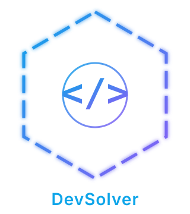

**LOGO Description:**

Main logo:

- </> → clear coding identity
- Circle → focus & containment
- Animated hexagon → engineering discipline, continuous system flow
- Subtle motion →continuous computation, premium, professional feel
- Glow + gradient -> futuristic aesthetic
- No overlaps → clean visual hierarchy

This is exactly how modern dev platforms design logos.

Favicon Logo:

